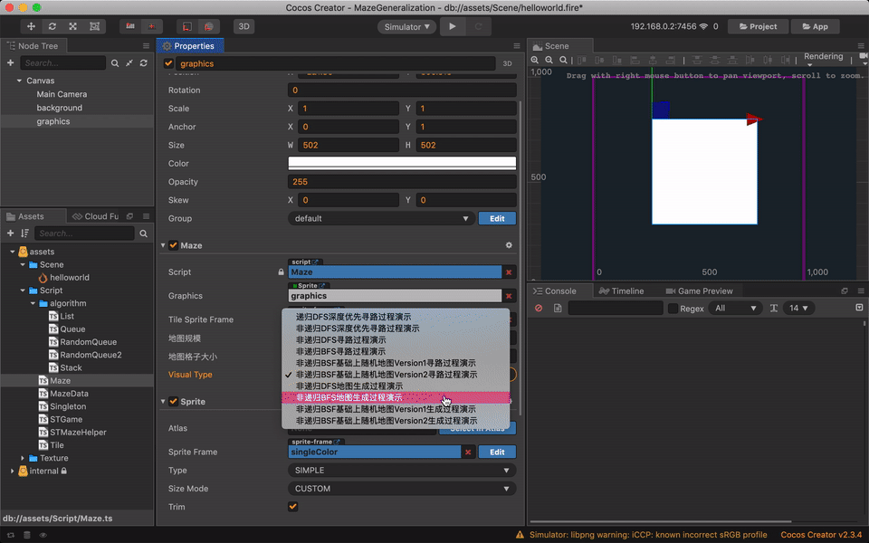
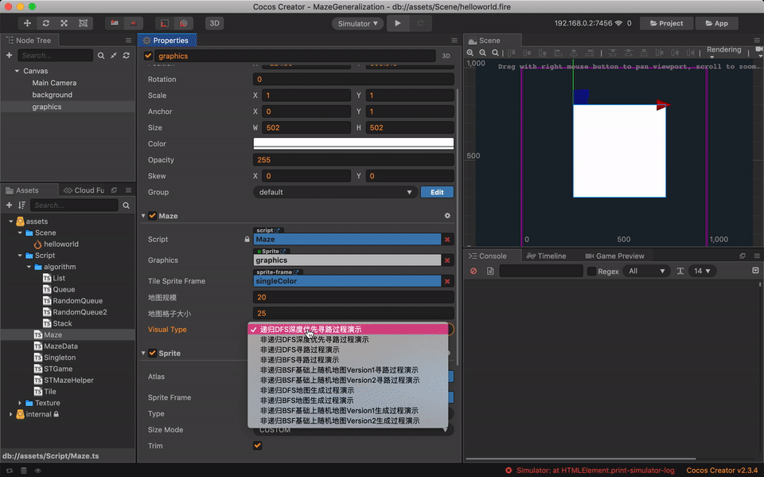
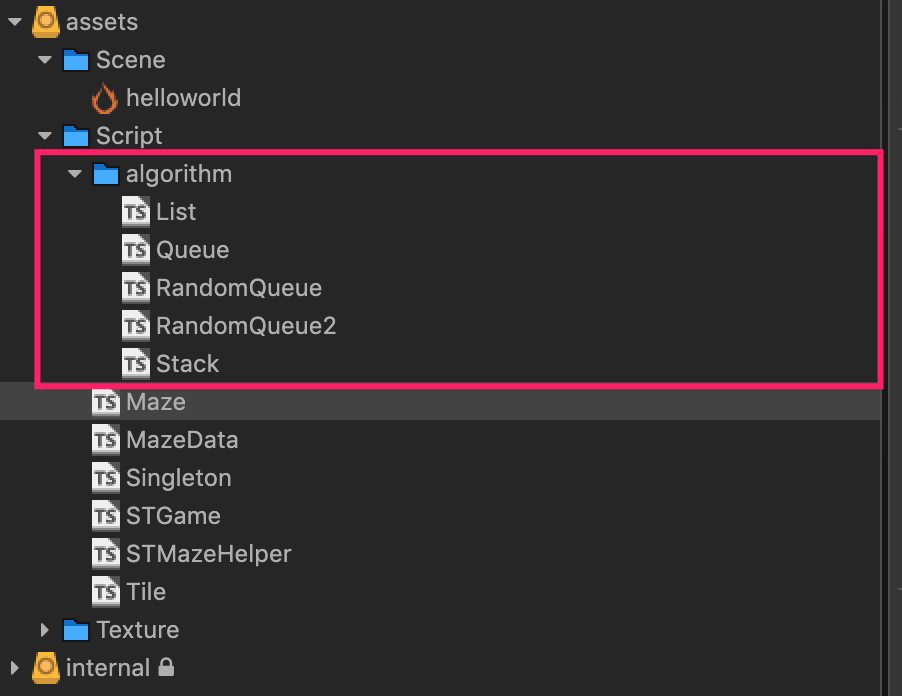
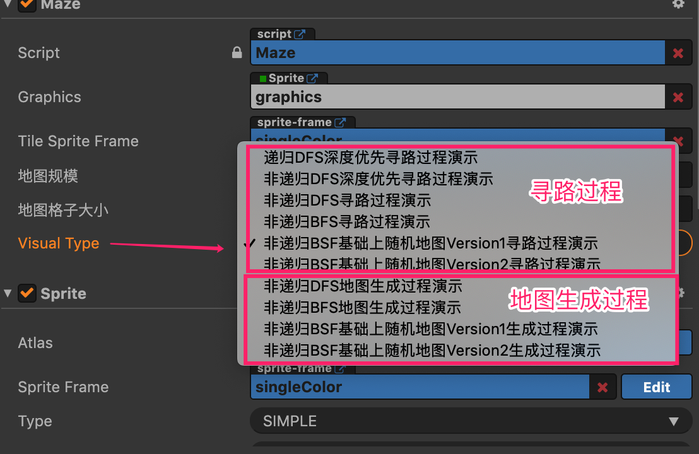
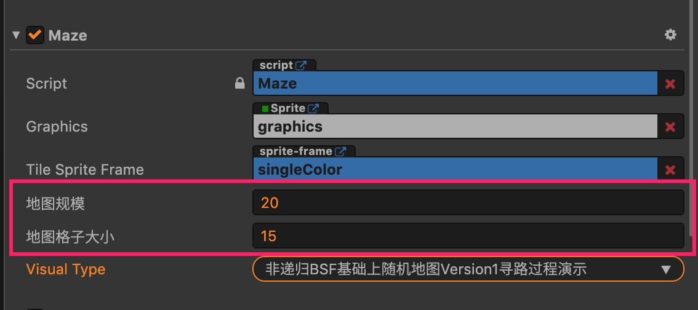

# 前言  

我的迷宫代码的实现受到[liuyubobobo/Play-with-Algorithm-Visualization](https://github.com/liuyubobobo/Play-with-Algorithm-Visualization/tree/master/06-Maze-Generalization) 的影响.  

liuyubobobo 迷宫的实现: GUI部分使用 java Swing, 编程语言是 Java.  
我的迷宫代码实现: GUI部分使用 Cocos Creator 游戏引擎, 编程语言是 TypeScript.  

Cocos Creator 源码工程 : 在 project 目录下.  

# 运行动画  

非递归实现的随机地图生成过程演示:  
  

非递归实现的随机地图生成寻路过程演示:  
  


# 开发环境  

- 操作系统: Macos  
- 游戏引擎: [Cocos Creator 2.3.4](https://www.cocos.com/creator)  
- 编程语言: TypeScript  

# 迷宫定义  

实现的迷宫是什么样子呢?   

迷宫的定义如下:  
- 只有一个入口, 只有一个出口  
- 只有一个解  
- 路径是连续的  
- 绘制在一个方形的画布上: 不是其它图形, 圆形等  
- 墙和路径都占一个单元格  

约定入口和出口: 入口在第2行第1列, 出口在最后一列的倒数第2行  
  

# 算法与数据结构  

迷宫的生成和寻路使用的算法:  
- BFS([Breadth-first search - Wikipedia](https://en.wikipedia.org/wiki/Breadth-first_search)) : 广度优先遍历  
- DFS([Depth-first search - Wikipedia](https://en.wikipedia.org/wiki/Depth-first_search)): 深度优先遍历  

涉及的数据结构的实现:  
在 `Script/algorithm` 文件夹下:  
- List : 线性表, 队列和栈的一个接口定义  
- Queue : 队列, 广度优先遍历非递归实现需要用到  
- Stack : 栈, 深度优先遍历非递归实现需要用到  
- RandomQueue : 随机队列, 使生成的地图更加随机, 不过仍然有点像BFS  
- RandomQueue2 : 随机队列,RandomQueue的改进版, 地图更加随机了  
  

# 代码的演示  

代码的演示包含两个部分:  
1. 地图已经生成的情况下, 从入口开始寻路找到出口  
2. 如何生成地图, 在有迷雾的情况下动态演示地图生成过程.  


共有 10 个演示, 可以在编辑器中通过 visualType 属性进行选择:  
  

支持地图规模修改以及地图格子大小的修改:  
  


# LICENSE

```
MIT License

Copyright (c) 2020 github-username:zhigang26 github-name: Imymirror 

Permission is hereby granted, free of charge, to any person obtaining a copy
of this software and associated documentation files (the "Software"), to deal
in the Software without restriction, including without limitation the rights
to use, copy, modify, merge, publish, distribute, sublicense, and/or sell
copies of the Software, and to permit persons to whom the Software is
furnished to do so, subject to the following conditions:

The above copyright notice and this permission notice shall be included in all
copies or substantial portions of the Software.

THE SOFTWARE IS PROVIDED "AS IS", WITHOUT WARRANTY OF ANY KIND, EXPRESS OR
IMPLIED, INCLUDING BUT NOT LIMITED TO THE WARRANTIES OF MERCHANTABILITY,
FITNESS FOR A PARTICULAR PURPOSE AND NONINFRINGEMENT. IN NO EVENT SHALL THE
AUTHORS OR COPYRIGHT HOLDERS BE LIABLE FOR ANY CLAIM, DAMAGES OR OTHER
LIABILITY, WHETHER IN AN ACTION OF CONTRACT, TORT OR OTHERWISE, ARISING FROM,
OUT OF OR IN CONNECTION WITH THE SOFTWARE OR THE USE OR OTHER DEALINGS IN THE
SOFTWARE.
```
